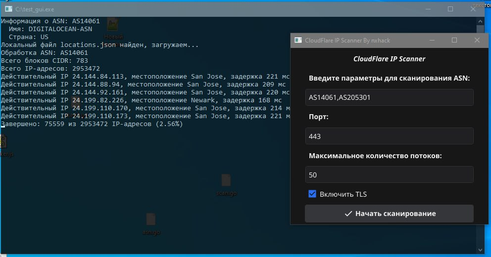

# CloudFlare IP Scanner

CloudFlare IP Scanner - это программа для сканирования IP-адресов ASN с использованием интерфейса командной строки или GUI. Программа позволяет находить CloudFlare IP CDN а также определяет местоположение и измеряет задержку (latency) валидных IP-адресов.



## Возможности

- Сканирование IP-адресов по номерам ASN
- Поддержка TLS
- Параллельная обработка запросов
- Сохранение результатов в CSV-файл
- Графический интерфейс пользователя (GUI) с использованием библиотеки Fyne

## Требования

- Go 1.16 или выше
- Библиотека Fyne (`fyne.io/fyne/v2`)

## Установка

1. Установите Go и настройте GOPATH.
2. Скачайте исходный код.

   ```sh
    git clone https://github.com/nxhack/CloudFlareIPScanner.git
    cd CloudFlareIPScanner
   ```

4. Установите зависимости.

    ```sh
    go mod tidy
    ```

## Сборка

Для компиляции программы выполните следующую команду:

    go build -o CloudFlareIPScanner main.go

Это создаст исполняемый файл `CloudFlareIPScanner` в текущем каталоге.

## Использование

### Запуск через командную строку

Запустите программу с необходимыми аргументами:

    ./CloudFlareIPScanner -asn <ASN номера> -port <порт> -max <максимальное количество потоков> -tls <true/false>

Пример:

    ./CloudFlareIPScanner -asn "AS13335,AS15169" -port 443 -max 50 -tls true

### Запуск графического интерфейса

Для запуска графического интерфейса просто запустите программу без аргументов командной строки:

    ./CloudFlareIPScanner

### Аргументы командной строки

- `-asn`: Номера ASN, разделенные запятыми (обязательно).
- `-port`: Порт для сканирования (по умолчанию 443).
- `-max`: Максимальное количество параллельных запросов (по умолчанию 50).
- `-tls`: Включить TLS (по умолчанию true).

## Пример использования

Запустите программу с параметрами командной строки для сканирования:

    ./CloudFlareIPScanner -asn "AS13335,AS15169" -port 443 -max 50 -tls true

#### Контакты
Telegram https://t.me/bitcraken
